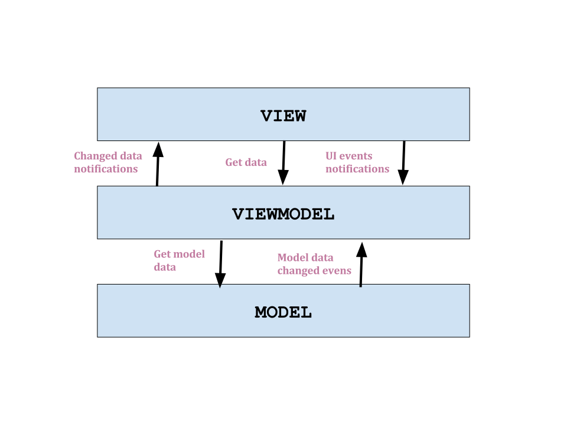
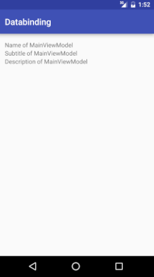

Android databinding
==========================================================

Databinding is a approach which connects data sources with data consumers and gives possibility to automatically update each other. Such approach was already developed for some time in other languages like C# (WPF) or Javascript (Angular, Knockout). Now finally it comes to Android.

How it worked before databinding
----------------------------------------------------------

Before databinding it was natural for Android that to set or get same value from control you should have reference to it firstly. 

```java
TextView label = (TextView) view.findViewById(R.id.textViewId);
label.setText("sample text");
String textFromLabel = label.getText();

Button button = (Button) view.findViewById(R.id.buttonId);
button.setOnClickListener(new View.OnClickListener() {
    public void onClick(View v) {
        // Perform action on click
    }
});
```

It introduces huge amount of code which was useless from application logic perspective. Of course there are external libraries like [Butter Knife](http://jakewharton.github.io/butterknife/) which helps a lot with this but it does not resolve an issue. Activities and fragments are still strictly bounded to resource layouts and have to carry all the references to controls.

Introducing of databinding gives possibility to implement MVVM pattern on Android. This pattern has been developed by Microsoft and it is variation of MVP pattern.



Main role in this pattern has view model object which mediates in exchange of data between view and the model. Comunication between view model and the view is made by using databinding. View has possibility to get current value of some data and view model can notify the view that data has changed. View can also pass ui events to view model that user has performed some action (e.g. text in text box has changed or button has been clicked).

How to setup project
-------------------------------------------------------------

Only thing that should be performed before databinding would be used in the android project is to setup gradle app file.

```gradle
android {
    dataBinding {
        enabled = true
    }
}
```

One way databinding
-------------------------------------------------------

Firstly you should create view model file which would be used in android layout file. Important thing is that view model class should extend BaseObservable class.

```java
public class MainViewModel extends BaseObservable {
    
}
```
Later on you should be able to reference view model class in your layout file. Main tag in the layout file should be `<layout>..</layout>`. 

```xml
<?xml version="1.0" encoding="utf-8"?>
<layout
    xmlns:android="http://schemas.android.com/apk/res/android"
    xmlns:tools="http://schemas.android.com/tools">
    <data>
        <variable name="viewModel" type="piotrek.databinding.MainViewModel"/>
    </data>
    <LinearLayout...>
</layout>
```

After that it should be able to create instance of generated binding class. Binding class name bases on layout file name. In activity class instating binding class should be performed instead of standard setContentView(..) method. Generated binding class should have method to set object used in layout reference.

```java
@Override
protected void onCreate(Bundle savedInstanceState) {
    super.onCreate(savedInstanceState);

    MainViewModel viewModel = new MainViewModel();
    MainViewBinding binding = DataBindingUtil.setContentView(this, R.layout.main_view);
    binding.setViewModel(viewModel);
}
```

Now view (layout file) and view model class is connected via code behind class (activity class) and later modifications would be done only in view and view model. First of all, all data that would be referenced in view should be defined in view model. One way binding (view can read values from the view model) can be achieved in 3 ways:

- public field
- public field of ObservableField<> type
- private field with public getter

```java
public class MainViewModel extends BaseObservable {
    private String name;
    public String subtitle;
    public ObservableField<String> description;

    public String getName(){
        return name;
    }

    public MainViewModel(){
        name = "Name of MainViewModel";
        subtitle = "Subtitle of MainViewModel";
        description = new ObservableField<>("Description of MainViewModel");
    }
}
```

All those fields can be referenced in layout file.

```xml
<?xml version="1.0" encoding="utf-8"?>
<layout
    xmlns:android="http://schemas.android.com/apk/res/android"
    xmlns:tools="http://schemas.android.com/tools">
    <data>
        <variable name="viewModel" type="piotrek.databinding.MainViewModel"/>
    </data>
    <LinearLayout
        android:layout_width="match_parent"
        android:layout_height="match_parent"
        android:orientation="vertical"
        tools:context=".MainView">

        <TextView
            android:layout_width="wrap_content"
            android:layout_height="wrap_content"
            android:text="@{viewModel.name}" />

        <TextView
            android:layout_width="wrap_content"
            android:layout_height="wrap_content"
            android:text="@{viewModel.subtitle}" />

        <TextView
            android:layout_width="wrap_content"
            android:layout_height="wrap_content"
            android:text="@{viewModel.description}" />
    </LinearLayout>
</layout>

```

When the view would be loaded then layout can automatically read values set in view model, without additional code in activity class.




Two way databinding
--------------------------------------------------

To achieve two way databinding it is needed to write some more additional code. Current Google implementation do not support out of the box automatic updates of view model triggered by view. 

To enable automatic updates of view model triggered by changing input of EditTextBox it is needed to create firstly binding adapter class.

In more complicated scenarios view model can be possesed by using some factory object. Factory would be resolved for DI container and other dependencies need by view model would be keep there. Factory would expose creating methods which only would take as arguments objects which are specific for each view and which cannot be resolved from DI container.

```java

public class MainViewModelFactory{
    
    private ISession session;
    
    public MainViewModelFactory(ISession session){
        this.session = session;
    }
    
    public MainViewModel create(IMainView view){
        return new MainViewModel(session, view);        
    }
}


```

How Andorid databinding works under the hood
--------------------------------------------------

Databinding firstly takes all layouts and looks inside of them binding expressions inside `@{...}` brachets. Then it tries to resolve those expressions into functions and based on them it will generate java code for propper set and get values in the layout controls. There is no magic behind. It is simply code generation similar to that which is in Butterknife or Dagger libraries. But this code generation makes creating layouts more easy. Activites or fragments classes are becoming only dummy linkers between view model and view objects. Only thing which still must be present in activities / fragments is handling navigation.
 
7. Summary