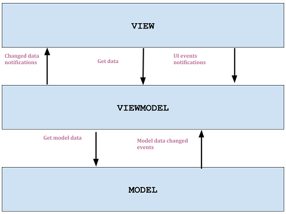

Android databinding
==========================================================

Databinding is an approach which connects data sources with data consumers and gives possibility to automatically update each other. Such approach was already developed for some time in other languages like C# (WPF) or Javascript (Angular, Knockout). Now finally it comes to Android.

How it worked before databinding
----------------------------------------------------------

Before databinding it was natural for Android that to set or get same value from control you should have reference to it firstly. 

```java
TextView label = (TextView) view.findViewById(R.id.textViewId);
label.setText("sample text");
String textFromLabel = label.getText();

Button button = (Button) view.findViewById(R.id.buttonId);
button.setOnClickListener(new View.OnClickListener() {
    public void onClick(View v) {
        // Perform action on click
    }
});
```

It introduces huge amount of code which was useless from application logic perspective. Of course there are external libraries like [Butter Knife](http://jakewharton.github.io/butterknife/) which helps a lot with this but it does not resolve an issue. Activities and fragments are still strictly bounded to resource layouts and have to carry all the references to controls.

Introducing of databinding gives possibility to implement MVVM pattern on Android. This pattern has been developed by Microsoft and it is variation of MVP pattern.



Main role in this pattern has view model object which mediates in exchange of data between view and the model. Communication between view model and the view is made by using databinding. View has possibility to get current value of some data and view model can notify the view that data has changed. View can also pass ui events to view model that user has performed some action (e.g. text in text box has changed or button has been clicked).

How to setup project
-------------------------------------------------------------

Only thing that should be performed before databinding would be used in the android project is to setup gradle app file.

```gradle
android {
    dataBinding {
        enabled = true
    }
}
```

One way binding
-------------------------------------------------------

Firstly view model class file should be created which would be used in android layout file. Important thing is that view model class should extend BaseObservable class.

```java
public class MainViewModel extends BaseObservable {
    
}
```
Later on it should be possible to reference view model class in layout file. Main tag in the layout file should be `<layout>..</layout>`. 

```xml
<?xml version="1.0" encoding="utf-8"?>
<layout
    xmlns:android="http://schemas.android.com/apk/res/android"
    xmlns:tools="http://schemas.android.com/tools">
    <data>
        <variable name="viewModel" type="piotrek.databinding.MainViewModel"/>
    </data>
    <LinearLayout...>
</layout>
```

After that it should be able to create instance of generated binding class. Binding class name bases on layout file name. In activity class instating binding class should be performed instead of standard `setContentView(..)` method. Generated binding class should have method to set object used in layout reference (`<data>..</data>` tag).

```java
@Override
protected void onCreate(Bundle savedInstanceState) {
    super.onCreate(savedInstanceState);

    MainViewModel viewModel = new MainViewModel();
    MainViewBinding binding = DataBindingUtil.setContentView(this, R.layout.main_view);
    binding.setViewModel(viewModel);
}
```

Now view (layout file) and view model class is connected via code behind class (activity class) and later modifications would be done only in view and view model. First of all, all data that would be referenced in view should be defined in view model. One way binding (view can read values from the view model) can be achieved in two ways:

- public field of ObservableField<> type
- private field with public getter and setter

```java
public class MainViewModel extends BaseObservable {
    private String name;
    public ObservableField<String> description;

    @Bindable
    public String getName(){
        return name;
    }
    
    public void setName(String newName){
        if (!Objects.equals(name,newName)) {
            name = newName;
            notifyPropertyChanged(piotrek.databinding.BR.name);
        }
    }

    public MainViewModel(){
        name = "Name of MainViewModel";
        description = new ObservableField<>("Description of MainViewModel");
    }
}
```

All those fields can be referenced in layout file.

```xml
<?xml version="1.0" encoding="utf-8"?>
<layout
    xmlns:android="http://schemas.android.com/apk/res/android"
    xmlns:tools="http://schemas.android.com/tools">
    <data>
        <variable name="viewModel" type="piotrek.databinding.MainViewModel"/>
    </data>
    <LinearLayout
        android:layout_width="match_parent"
        android:layout_height="match_parent"
        android:orientation="vertical"
        tools:context=".MainView">

        <TextView
            android:layout_width="wrap_content"
            android:layout_height="wrap_content"
            android:text="@{viewModel.name}" />

        <TextView
            android:layout_width="wrap_content"
            android:layout_height="wrap_content"
            android:text="@{viewModel.description}" />
    </LinearLayout>
</layout>

```

When the view would be loaded then layout can automatically read values which are set in view model, without additional code in activity class. The same situation would be when view model would trigger change of the values. UI controls would be automatically updated.

One time binding
-------------------------------------------------------

Specific type of one way binding is one time binding. It bases on the fact that value is loaded into view only one time. Later on view would not receive any updates of this value. Such bindings can be used to display some kind of labels or another texts which are loaded only once.

To use such binding, view model should have simple, not observable, public field. Attaching them into view is the same as in one way binding.

How Android databinding works under the hood
--------------------------------------------------

Databinding first takes all layouts files and looks inside of them for main root `<layout></layout>`. If such was found then it means that it is databinding layout. Later on such databinding layouts are put into layout processor and are transformed into new layouts which are understandable by older versions of android. During processing the layout, `<layout></layout>` tag is being erased and all namespaces inside of it are transferred into first visual child (skipping firstly `<data></data>` tag). Then `android:tag=""` is added to all controls, tag name is generated automatically. Later on all UI controls variables are being created. It is done based on information found in layout file. As a next step, binding expressions inside `@{...}` brackets are being translated into appropriate getters and setters methods. 

As it is shown, there is no magic behind. It is simply code generation, with no reflection, similar to that which is in Butterknife or Dagger libraries. All those things are being done at the compile time.

Two way binding
--------------------------------------------------

To achieve two way databinding it is needed to write some more additional code. Current Google implementation does not support out of the box automatic updates of view model triggered by view. 

To enable automatic updates of view model triggered by changing input of some control it is needed to create binding adapter class. Binding adapter class should be specific for each control. It is caused because each control set their value in different way.

```java
public class EditTextBoxBinding {
    @BindingAdapter({"textBinding"})
    public static void bindEditText(EditText view, final BindableType<String> text) {
        if (text == null)
            throw new IllegalArgumentException("BindableType<String> object cannot be null");

        if (view.getTag(R.id.dataBinding) == null){
            view.setTag(R.id.dataBinding, true);
            view.addTextChangedListener(new TrimmedTextWatcher() {
                @Override
                public void onTextChanged(String newValue) {
                    text.set(newValue);
                }
            });
        }

        String textFromView = view.getText().toString();
        String textFromViewModel = text.get();

        if (!textFromView.equals(textFromViewModel)) {
            view.setText(textFromViewModel);
        }
    }
}
```

In the first part of the method it is checked if binding was already attached into control. If it wasn't then text changed listener is added which updates the view model value. In the second part of the method two values, from the view and the view model are being compared. If they are different then it means that value in view model was changed and the view must be updated.

Such defined binding can be used in layout view file. Of course before using it, `public BindableType<String> description` should be defined in view model.

```xml
<EditText
    android:layout_width="match_parent"
    android:layout_height="wrap_content"
    app:textBinding="@{viewModel.description}"/>
```

After running such code, view model would automatically receiving updates if EditText control input would change. As it is shown `android:text=""` markup property is not used. All work is done by `app:textBinding=""`.

Important thing to mention is that `ObservableField<>` type cannot be used even if it does the same as `BindableType<>` type. The reason is that android databinding framework hides its observability to binding adapter classes and it was done intentionally. 

 
Summary
--------------------------------------------------

Android databinding is a step into good direction for eliminating useless parts of code from the app logic perspective. Activities and fragments classes become dummy linkers which do not have any parts of code which manipulates on data. It gives also possibility to implement MVVM pattern which is very popular in other frameworks and gives alternative for currently most used in Android MVP pattern. 

Of course it is still under development and the biggest drawback is lack of support two way bindings. Creating them for their own is not easy and needs a lot of effort to do that. There is also no guarantee that they would still work when the new version of Android Databinding will go live. 

In my opinion Android Databinding with MVVM pattern is ready to use in production apps but not in all situations. If we have simple view which presents data stored in model and eventually should react on model updates then databinding with MVVM is the best approach. Situation is different when view would contain a lot of controls for interaction with user (e.g. text inputs, spinners, date and time pickers) then classic MVP is better. In my opinion the worst thing which can be done in such complicated views is to mix classic android approach with databinding. Code which is result of such mix may look unclear and might be hard to maintain in the future. 

In my opinion, when Android Databinding would officially support two way bindings then MVVM would completely replace MVP pattern.   

Sample app which has two way bindings for some most used controls can be found [here](https://github.com/pblachut/AndroidDatabinding)

Related links about Android databinding:
- [Google Developer guide](http://developer.android.com/tools/data-binding/guide.html)
- [Databinding on Android dev summit 2015](https://www.youtube.com/watch?v=NBbeQMOcnZ0&index=5&list=WL)
- [Radosław Piekarz on droidcon Kraków 2015](https://www.youtube.com/watch?v=5EPbPBarWhI)
